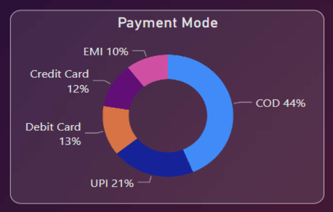
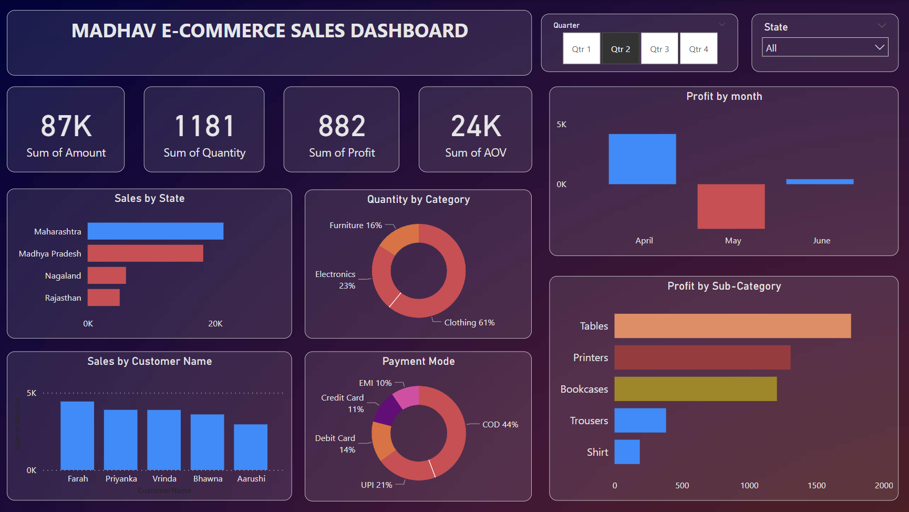

# Madhav Stores Annual Sales Dashboard 

## Project Overview

This project involves the creation of an interactive annual sales dashboard for Madhav Stores using Power BI. The dashboard provides valuable insights into sales performance, customer behavior, and profit distribution. The insights are categorized and organized for ease of understanding.

## Dashboard Components

### 1. Sales by State
The states (MH, MP, UP, Delhi) with the highest sales are visually represented.

### 2. Sale Quantity by Categories
Clothing, furniture, and electronics are the top-performing categories in terms of sales quantity.

### 3. Most Used Payment Mode
Cash on Delivery (COD) and (UPI) is the most frequently used payment mode.

### 4. Customer with Highest Sales
Harivansh, Madhav, Madanmohan, Shiva, and Vishaka are the top customers based on sales.

### 5. Profit Distribution Over Month
Monthly distribution of profits projects November has the highest profit.

### 6. Profit by Sub-category
 Profits generated by sub-categories, including Printers, Bookcase, Saree, Accessories, and Tables.

## Insight Section

### 1. Sales Insights
   - **Highest Sales States:** Delhi > UP > MH > MP
   - **Top Sales Categories:** Electronics > Furniture > Clothing
   - **Most Used Payment Mode:** COD followed by UPI

### 2. Customer Insights
   - **Top Customers:** Harivansh > Madhav > Madanmohan > Shiva > Vishaka

### 3. Profit Insights
   - **Monthly Profit Distribution:** Visualization of profit variations over the months.
   - **Sub-category Profits:** Printers > Bookcase > Accessories > Saree > Tables

## Dashboard View

## How to Use the Dashboard

1. **Slicers:**
   - Utilize slicers for filtering data by state, or time period.
   - Adjust the time period to explore monthly profit distribution.

2. **Interactive Charts:**
   - Hover over data points for detailed information.
   - Click on legends or categories to isolate specific data for in-depth analysis.

## Additional Notes

- Ensure that Power BI is installed to interact with the dashboard.
- Keep the dataset updated for accurate and real-time insights.
- Explore additional visualizations or customizations based on evolving business needs.

