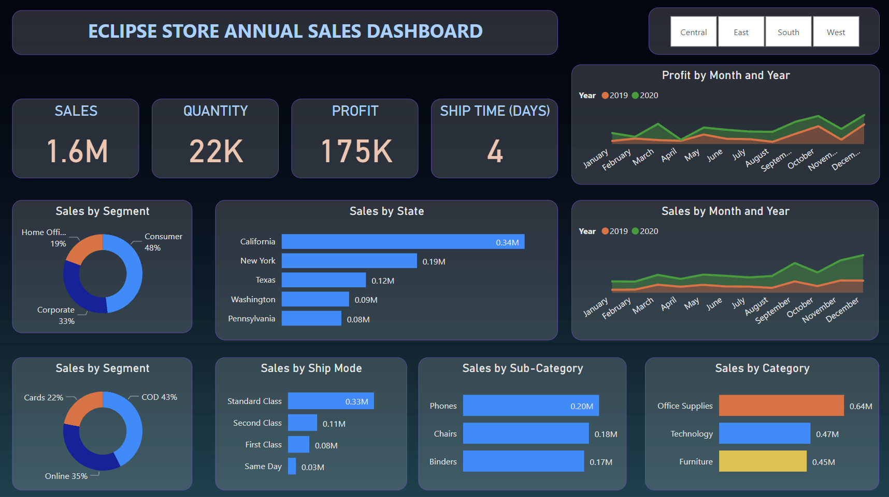

# Eclipse Store Analysis

## Project Overview

This project involves the creation of an interactive annual sales dashboard for Madhav Eclipse Store using Power BI. The dashboard provides valuable insights into sales performance, customer behavior, and profit distribution. 

A 15 days data forecasting is done on sales on the dasis of date. This method gives an ideology about how the data will change in following days.

## Dashboard Components

### 1. Sales by State
The states (MH, MP, UP, Delhi) with the highest sales are visually represented.
### 2. Payment methods
COD, Online payment and card are the payment methods
### 3. Sales by month and year
This shows a comparitive analysis between sales of the yaer 2020 and 2019 segregated by months. Another similar plot of profit is also provided.
### 4. Sales by segment
This include major segments like home office, consumer, corporate etc.
### 5. Sales by category and sub category
Office supplies, technology and furniture are the major category also provided with major sub categories like phone, chair and binders.
### 5. KPI
Sales, Quantity of sales, net profit and ship date are shown as the major key  performances indicator.

## Dashboard View
### Overall

### South

## Data Forecasting

Data forecasting is a method that utilizes historical data to make  predictions about future trends using statistical methods. This technique is vital for businesses as it assists in planning for expected costs, distributing resources, and making strategic decisions.

Here we have forecasted sales on the basis of date, a 15 days forecasting is visualised.

1. **Slicers:**
   - Utilize slicers for filtering data by state, or time period.
   - Adjust the time period to explore monthly profit distribution.

2. **Interactive Charts:**
   - Hover over data points for detailed information.
   - Click on legends or categories to isolate specific data for in-depth analysis.

## Additional Notes

- Ensure that Power BI is installed to interact with the dashboard.
- Keep the dataset updated for accurate and real-time insights.
- Explore additional visualizations or customizations based on evolving business needs.

